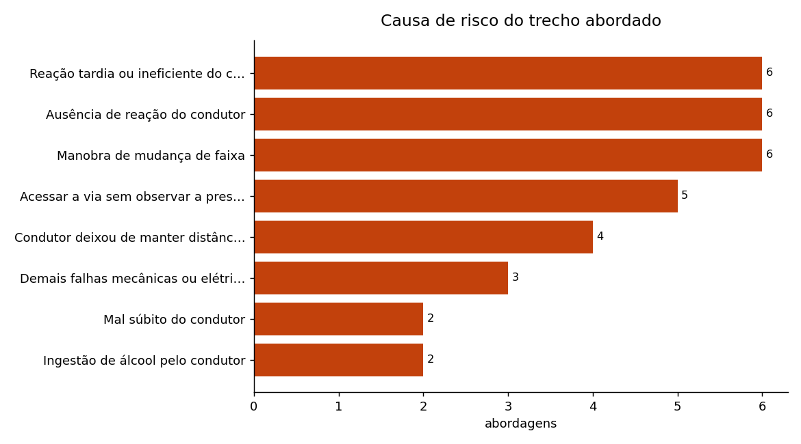
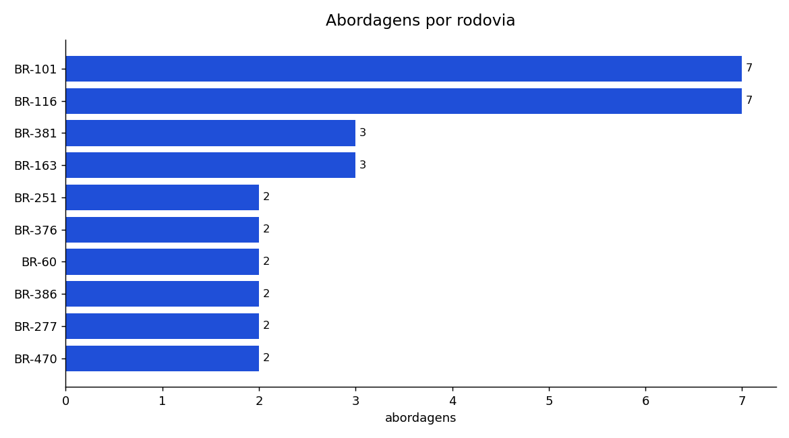

# ETL de sinistros com IA generativa

Pipeline ETL assíncrono que cruza a base aberta de sinistros de trânsito do Datatran
(2024–2025) com abordagens de trânsito e usa um LLM para transformar cada registro em
um **alerta específico daquele trecho de rodovia** — não em uma frase genérica de
segurança.

[](https://github.com/danilogep/etl-sinistros-ia-generativa/actions/workflows/ci.yml)
[](https://python.org)
[](https://ai.google.dev/)
[](LICENSE)



*As causas que mais aparecem nos trechos amostrados. Não é a causa do acidente do
condutor abordado — é o histórico do quilômetro em que ele está, e é isso que entra
no prompt.*



*A concentração por rodovia mostra onde a amostragem do Datatran cai com mais
frequência: BRs com mais registros históricos aparecem mais, porque o seed sorteia
trechos proporcionalmente ao volume de sinistros.*

---

## Antes e depois

É o que o pipeline faz, em uma linha. À esquerda, um registro cru do Datatran. À
direita, o mesmo trecho depois de virar contexto e passar pelo modelo.

<table>
<tr><th width="50%">Registro bruto (datatran2025.csv)</th><th width="50%">Saída do pipeline</th></tr>
<tr valign="top"><td>

```
id                     694262
data_inversa       2025-05-28
dia_semana      quarta-feira
horario              13:40:00
uf                         SP
br                        381
km                         37
municipio            ATIBAIA
causa_acidente     Ausência de
                   reação do
                   condutor
tipo_acidente    Tombamento
classificacao    Com Vítimas
                   Feridas
```

Um fato consumado, no passado, sobre
uma vítima anônima. Não serve de aviso
para ninguém.

</td><td>

```
Nome              Carlos Silva
Veiculo           Nissan Kicks
Placa                ABC-2850
UF / BR / KM     SP / 381 / 37
Municipio             ATIBAIA
Causa_Frequente   Ausência de
                  reação do
                  condutor
```

**Mensagem_IA**

> *"Carlos Silva, Kicks, BR-381, KM 37,
> Atibaia: Atenção redobrada! Alto risco
> de acidentes por falta de reação.
> Dirija com foco!"*

</td></tr>
</table>

O ganho não está no texto bonito: está em o prompt carregar **BR, km, município e a
causa historicamente frequente naquele ponto**. Um alerta que diz "dirija com cuidado"
não muda comportamento; um que diz "neste km, o que mais causa acidente é falta de
reação" é acionável.

Mais exemplos de saída real em [`data/exemplo_saida.csv`](data/exemplo_saida.csv).

---

## Custo, tempo e limites

A primeira pergunta de quem contrata um pipeline com LLM é quanto ele custa rodando.

| | |
|---|---|
| Registros por execução | 50 por padrão (`--quantidade` no seed, `--limite` no pipeline) |
| Tokens por registro | ~101 de entrada, ~31 de saída (medido sobre os prompts reais) |
| **Custo por 1.000 registros** | **≈ US$ 0,022** com Gemini 2.0 Flash (US$ 0,10/1M entrada, US$ 0,40/1M saída) |
| Chamadas simultâneas | 8 por padrão (`ETL_CONCURRENCY`) |
| Tempo sem API (`--sem-ia`) | 1,3 s para 50 registros — extract + transform + carga + 2 gráficos |
| Tempo com API | depende de `ETL_CONCURRENCY` e do tier da chave; acima de ~10 simultâneas o free tier devolve 429 e o retry passa a dominar |

O cálculo de custo é uma estimativa direta: comprimento médio do prompt e da resposta
dividido por 4 caracteres por token, multiplicado pelo preço de tabela. Não há
contador de tokens em produção — se isso virar requisito, o lugar é
`src/transform.py`, onde a resposta já volta inteira.

**Mitigações de custo que estão no código:**

* `--sem-ia` roda o pipeline inteiro sem tocar na API (é o que o CI usa).
* Registros malformados são descartados **antes** do enriquecimento: um nome vazio não
  consome chamada paga.
* O retry distingue falha transitória de permanente. Repetir três vezes um
  `API key not valid` só queima tempo; só 429/503/timeout entram no retry, com espera
  exponencial.
* Uma falha isolada não derruba o lote — o registro é marcado com `Erro_IA` e os outros
  49 seguem, em vez de perder 49 chamadas já pagas.

---

## Rodando

### Com Docker (nada a instalar)

```bash
cp .env.example .env          # preencha GOOGLE_API_KEY
docker compose run --rm seed       # gera a massa de abordagens
docker compose run --rm pipeline   # enriquece e gera os relatórios
```

Sem chave de API? O pipeline roda inteiro offline:

```bash
docker compose run --rm pipeline src.pipeline --sem-ia
```

### Local

```bash
python -m venv venv && venv/Scripts/activate     # Linux/macOS: source venv/bin/activate
pip install -r requirements.txt
cp .env.example .env

python -m src.seed_data --quantidade 50 --semente 42
python -m src.pipeline
```

| Flag | Efeito |
|---|---|
| `--limite N` | processa só os N primeiros registros |
| `--sem-ia` | alertas simulados, sem chamar a API (custo zero) |
| `--semente N` (seed) | amostra reproduzível do Datatran |

Saídas em `data/abordagens_enriquecidas.csv` e `img/`.

---

## Arquitetura

```
data/datatran2024.csv ─┐
data/datatran2025.csv ─┴─► src/seed_data.py ──► data/abordagens.csv
                                                      │
                                              src/extract.py      valida e descarta
                                                      │           registro malformado
                                                      ▼
                                              src/transform.py    asyncio + semáforo
                                                      │           Gemini 2.0 Flash
                                                      │           retry exponencial
                                                      ▼
                                              src/load.py         CSV + 2 gráficos
```

| Módulo | Responsabilidade |
|---|---|
| `src/config.py` | caminhos e variáveis de ambiente; a chave é lida **sob demanda**, não no import |
| `src/seed_data.py` | sorteia trechos reais do Datatran e inventa condutores sobre eles |
| `src/extract.py` | lê o CSV, valida colunas, descarta registro inutilizável |
| `src/transform.py` | monta o prompt com o contexto do trecho, chama a API, trata falha |
| `src/load.py` | grava o CSV enriquecido e gera os gráficos |
| `src/pipeline.py` | orquestra, cronometra e registra em log |

### Duas decisões que valem explicar

**O cliente da API é construído sob demanda.** Antes, `genai.configure()` rodava no
import de `transform.py` e `config.py` levantava `ValueError` sem `.env` — o que tornava
o módulo impossível de importar, e portanto de testar, sem chave. Hoje `_get_model()`
é o único ponto que precisa da chave, e é exatamente o ponto que os testes substituem.

**O paralelismo é limitado por semáforo.** `asyncio.gather` sobre 50 registros dispara
50 requisições simultâneas, e o free tier responde 429 em quase todas — o pipeline
fica *mais lento* por excesso de paralelismo. `ETL_CONCURRENCY` (8 por padrão) segura
a vazão em algo que a API aceita.

---

## Testes

```bash
pip install -r requirements-dev.txt
pytest
```

```
23 passed in 4.54s
```

**Nenhum teste faz chamada de rede.** O CI roda sem `GOOGLE_API_KEY` definida, e é isso
que prova a afirmação — se algum teste escapasse para a API, o job quebraria.

| Arquivo | O que trava |
|---|---|
| `tests/test_extract.py` | leitura do CSV, km com vírgula decimal sobrevivendo à leitura, coluna obrigatória ausente, e quatro formas de registro malformado sendo descartadas sem derrubar o lote |
| `tests/test_transform.py` | o prompt carrega BR/km/município/causa, o retry repete 429 e **não** repete `API key not valid`, uma falha isolada não derruba o lote, e `--sem-ia` não constrói o cliente da API |
| `tests/test_load.py` | CSV e os dois gráficos saem onde deveriam, acentuação preservada, coluna ausente pula o gráfico sem perder a carga |

O CI ainda roda o pipeline **ponta a ponta em modo offline** e confere que os três
arquivos de saída existem.

---

## Dados

[Datatran](https://www.gov.br/prf/pt-br/acesso-a-informacao/dados-abertos/dados-abertos-da-prf) —
base pública de sinistros em rodovias federais brasileiras, 2024 e 2025.

Os condutores, placas e veículos em `data/abordagens.csv` são **fictícios**. O que vem
da base real são os trechos (UF, BR, km, município) e a causa de sinistro frequente
neles — é esse cruzamento que dá contexto ao alerta.

## Licença

Código sob [MIT](LICENSE). Os dados seguem a licença da fonte original.
